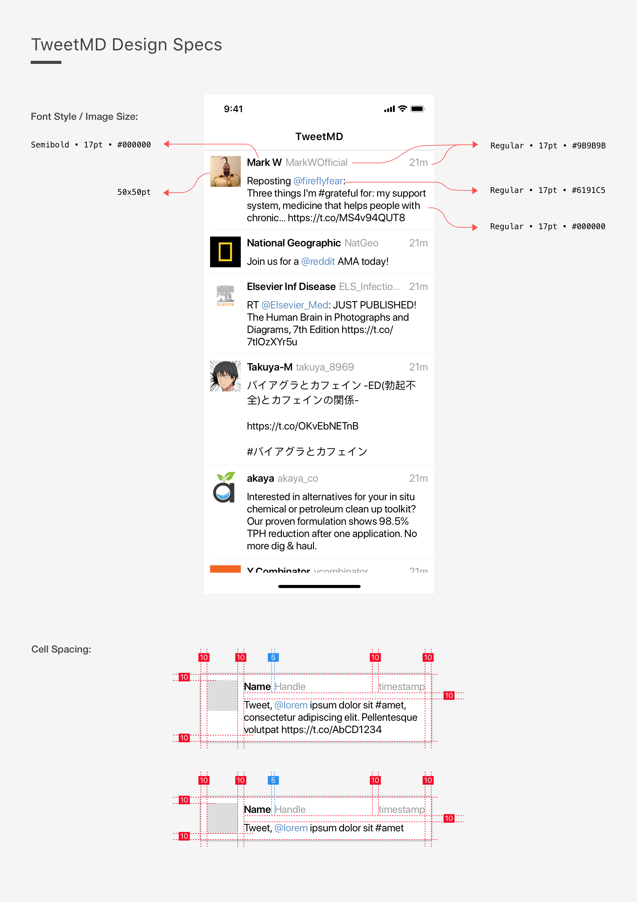

# Coding Assignment

We would like to thank you for taking the time to complete this assignment. We believe this is an effective way to allow you to show us your skills, on your own time, without the pressure of someone looking over your shoulder. Your code will be used to help us decide if we'd like to proceed with the interview process. Please understand that completing this assignment doesn't guarantee a job or follow up interviews. We will keep you posted either way.

# TweetMD

TweetMD is a little app we created exclusively for the take home assignment. It allows clinicians to stay up to date on the latest medical tweets! It uses the [Twitter API](https://dev.twitter.com/rest/public) to fetch the top 30 recent tweets about 'medicine' and displays them for your viewing pleasure (regardless of actual relevance to medicine...)

We have already completed a big portion of TweetMD. It's coming along, but we need your help to polish it up!

### Getting Set Up
1. **FORK** this repository onto your personal GitLab account
2. Clone your fork: `git clone git@gitlab.com:[your_gitlab_username]/ios-engineer-tweet-md.git`
    Note: If you logged into GitLab with your GitHub account, you may need to add your [public SSH key](https://gitlab.com/profile/keys) for this to work.
3. Create a branch named with the following format: `firstName_lastName_tweetMD`. Use this branch for all of your changes.
4. Open TweetMD.xcworkspace

### Submission Instructions
1. In the settings of your fork, add `ios-assignment-review@doximity.com` as a developer.
2. Complete all tasks on  ****YOUR**** fork and create a merge request from your `firstName_lastName_tweetMD` branch.
3. On your merge request, add `ios-assignment-review@doximity.com` as an assignee.
4. If you'd like to include comments to explain your thought process, feel free to do so within the code or in the description of your merge request.
5. Please do not add any new third party libraries, but feel free to note in the comments if you were considering doing so.

### What to Expect after you Submit
Our team will be notified and we'll review the submission within 3 days. Among other things, we'll be checking for:
* Ability to fully meet the requirements of each task as specified
* Well-architected, robust, and maintainable code
* Expertise with UIKit and AutoLayout
* Ability to interpret and leverage existing code and documentation

We know your time is valuable and appreciate you taking the time to complete this assignment!

# Tasks

As a heads up, for the final task, we will ask you to "code review" the initial TweetMD source code that was provided to you. So as you work on the tasks, it may be helpful to keep your eyes open for pieces of the project that you would improve on! 

### Task 1
The cells on the tweet feed need a few UI updates. Use the design specs below to complete the following updates:
  1. The top row of each cell contains 3 pieces of information: name, handle, and timestamp. The name and handle should stick to the left, and the timestamp should stick to the right. If there is not enough space to fit all three labels, first truncate the handle, then truncate the name. The timestamp should always display completely.
  2. Update the cells so that their views are laid out consistently for various device sizes.
  3. Each cell currently shows only one line of the tweet body. Update the layout so the tweet content wraps and the cells size themselves to fit the entire tweet content.

### Task 2
The images on the tweet feed are causing some lag while scrolling. Update the logic to eliminate the lag.

### Task 3
  1. The date label sometimes shows the incorrect time elapsed string. Please find and fix the issue.
  2. Unit tests are a great way to avoid future issues with the time elapsed labels. We've included a test target that integrates the [Quick](https://github.com/Quick/Quick) and [Nimble](https://github.com/Quick/Nimble) test frameworks. Please write tests to ensure that the time elapsed method continues to work appropriately.

### Task 4
We want to highlight user mentions (e.g., @doximity) in the tweet body. The `Tweet` object has a `userMentions` property of type `[UserMention]`, but it is currently initialized to an empty array.

1. Populate the `userMentions` array with any `UserMention`s that are associated with the given tweet
2. Add functionality to change the text color of user mention names to `UIColor.actionBlue()` in the tweet body label

### Task 5
Currently, the button to 'favorite' a tweet exists, but it doesn't do anything. Implement the 'favorite' and 'unfavorite' functionality as follows:
  * When tweets are not favorited:
    1. The button should have background color `UIColor.actionBlue()`
    2. The button text should be "Add to Favorites"
    3. The corresponding row on the home feed should have background color `UIColor.white`
  * When tweets are favorited:
    1. The button should have background color `UIColor.darkGray`
    2. The button text should be "Remove from Favorites"
    3. The corresponding row on the home feed should have background color `UIColor.yellow`

*NOTE: Starred tweets do not need to persist across sessions. This means that when I kill / restart the app, my previous stars do not need to be saved.*

### Task 6
One of our core values at Doximity is to leave the code better than you found it. 

For this task, please take a look at the TweetMD project as a whole (as if you were performing a code review on the entire code base) and list out any changes you would make to the code if it were your own project. We've included a file `Task6.md` in the project where you can add your comments.

Some examples for suggested changes are performance improvements, code reorganization, bug fixes, simplification of code, anything! Be as specific as possible with your suggested changes/solutions. 

You don't actually have to implement the changes you're suggesting (unless you have already or want to). We're mostly looking for the ability to identify possible optimizations and improvements in the code.
